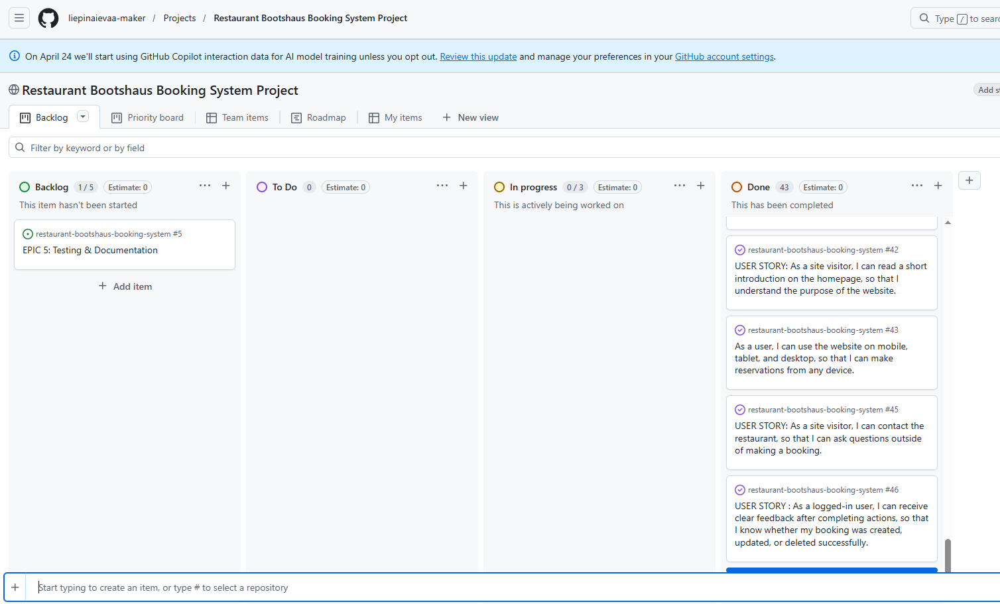
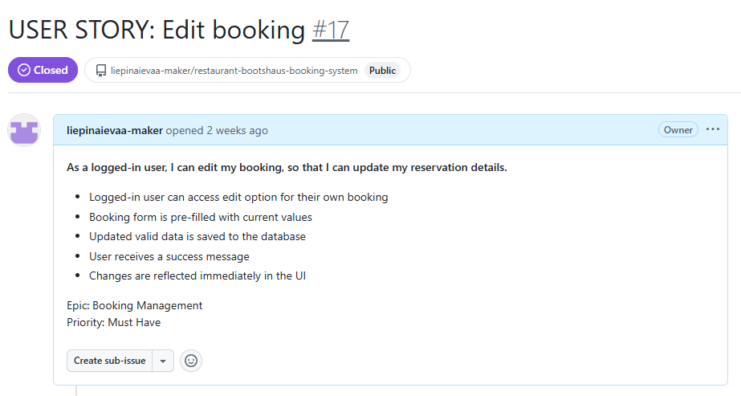
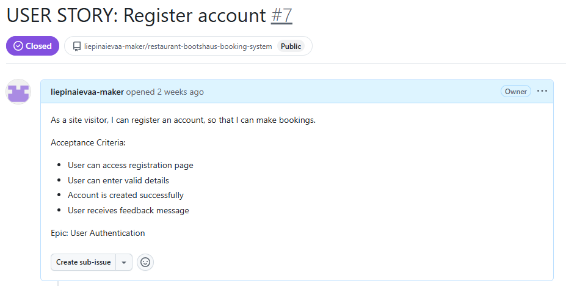
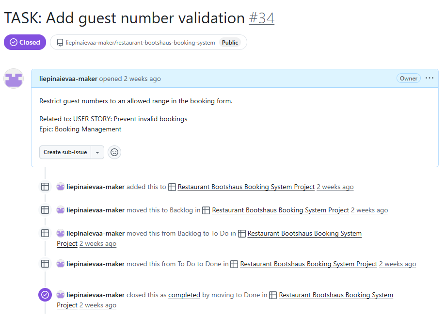
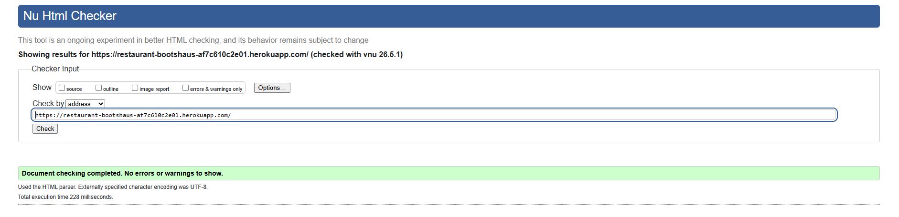
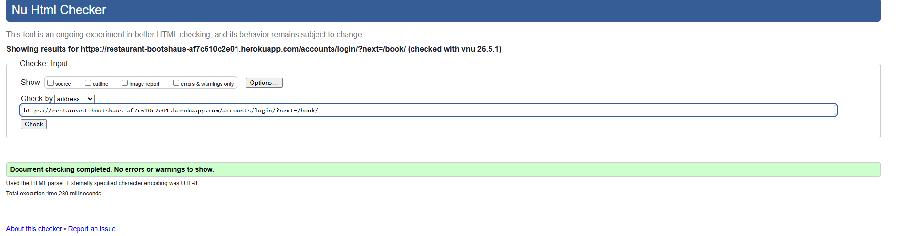
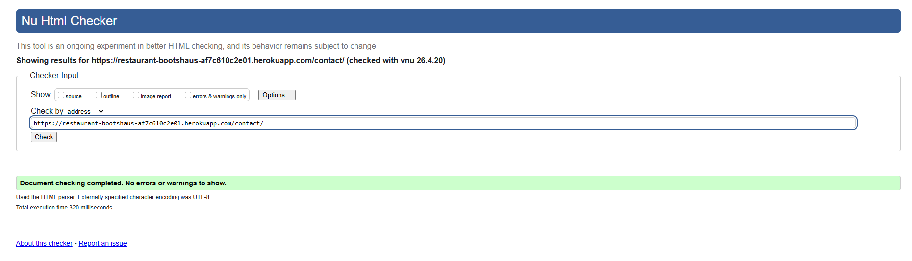

# Restaurant Bootshaus booking system

Project developer: <strong>Ieva Liepina</strong>

## Project Overwiew

 - Bootshaus Restaurant Booking System is a web application that allows users to create, manage, and modify table reservations online. The platform is designed to simplify the booking process for customers while providing restaurant staff with an efficient way to manage reservations.

 - Users can register an account, log in, and book tables for specific dates and times. The system includes validation rules such as limiting bookings per time slot and ensuring valid input for guest numbers and booking details.

 - The application also provides a contact form, allowing visitors to send inquiries directly to the restaurant.

 - The project was built using Django and deployed on Heroku.

 

 - [Here is a link to my deployment](https://restaurant-bootshaus-af7c610c2e01.herokuapp.com/)

## Table of Contents
- [Project Overview](#project-overview)
- [User Experience](#user-experience-ux)
- [Agile Development](#agile-development)
- [Design](#design)
- [Features](#features)
- [Data Model](#data-model)
- [Technologies Used](#technologies-used)
- [Testing](#testing)
- [Bugs](#bugs)
- [Deployment](#deployment)
- [Credits](#credits)
- [Acknowledgements](#acknowledgements)

## User Experience (UX)

### Target Audience

#### The Bootshaus Restaurant Booking System is designed for:

 - Customers who want to easily reserve a table online
 - Restaurant staff who need a simple way to manage bookings
 - Visitors who want to contact the restaurant with inquiries

### User Goals

#### Users visiting the website expect to:

 - Create an account and log in securely
 - Book a table for a specific date and time
 - View and manage their existing reservations
 - Edit or cancel bookings if needed
 - Contact the restaurant for additional questions

### Site Owner Goals

#### The site owner (restaurant) aims to:

 - Manage reservations efficiently
 - Prevent overbooking using time slot limits
 - Collect customer booking information
 - Receive messages through the contact form
 - View and manage bookings via the admin panel

### User Stories

#### As a user, I want to:

 - Register an account so that I can make bookings
 - Log in and log out securely
 - Book a table for a chosen date and time
 - View my bookings
 - Edit or cancel my bookings
 - Receive feedback when actions are successful or invalid 

#### As a site owner, I want to:

 - View all bookings in the admin panel
 - Manage customer reservations
 - Receive contact messages from users

## Agile Development

This project was planned and managed using GitHub Projects following Agile methodology. 

The Kanban board was used to organise development into the following coumns:

- Backlog
- To Do
- In Progress
- Done

The project was structured using:

- Epics (high-level features);
- User Stories (user-focused requirements)
- Tasks (implementation steps)

Each user story included acceptance criteria and was broken down into smaller implementation tasks for development.

Due to the iterative nature of the project, not all user stories were completed at first, but the most important features were prioritised and completed within the project timeframe, as well the other tasks. A total of approximately 40 user stories and tasks were created to guide the development process.

- User stories were prioritised based on importance, with core booking functionality implemented first to ensure the application met its primary purpose.

Screenshots below show examples of the project board, user stories, and task progression throughout development. 

- [User stories can be viewed here](https://github.com/users/liepinaievaa-maker/projects/9/views/1)

## Design

### UX Design

- The application was designed with a focus on simplicity and usability. Users can easily navigate the site, understand its purpose, and perform actions such as booking a table or contacting the restaurant with minimal effort. 
- The layout follows common web design patterns, ensuring familiarity and ease of use.

### Colour Scheme

- The site uses a dark navigation bar with light buttons and neutral Bootstrap styling to create a clean restaurant-style interface. The design keeps the focus on booking functionality and restaurant imagery.

### Typography

- The project uses default Bootstrap typography to maintain readability and consistency across pages.

### Imagery

- Restaurant images are used on the homepage to create a welcoming first impression and show the atmosphere of the restaurant.

### Wireframes

Wireframes were created during planning to guide the structure of the main pages:
- Homepage
- Booking form
- My Bookings page
- Contact page

### Responsive Design Testing

- The application was tested on different screen sizes using browser developer tools. The layout remained usable on mobile, tablet, and desktop screens.

## Features

### Navigation

- Responsive navigation bar available on all pages
- Links to Home, Book Table, Contact, Login, and Sign Up
- Dynamic navigation options based on user authentication

### User Authentication

- Users can register an account
- Users can log in and log out securely
- Only authenticated users can create bookings
- Booking pages are protected using login-required access
- Users are required to log in before making a booking so that each reservation can be linked to the correct account. This allows users to view, edit, and delete only their own bookings and prevents unauthorised access to other users reservation data.

### Booking System

- Users can create table reservations
- Bookings are made for specific dates and time slots
- Time slots are limited to hourly intervals (12:00 – 21:00)
- Each time slot allows a maximum of 3 bookings
- Guest numbers are limited between 1 and 10

### Booking Management

- Users can view their bookings
- Users can edit existing bookings
- Users can delete bookings
- Bookings are filtered per user

### Validation and Error Handling

- Users cannot book past dates
- Guest numbers are validated (1–10 guests)
- Time slot availability is checked to prevent overbooking
- Full name must include at least first and last name
- Clear error messages are displayed for invalid input

### Contact Page

- Users can send messages to the restaurant
- Contact form includes name, email, and message
- Messages are stored in the database
- Admin can view contact requests

### Admin Panel

- Admin can view and manage all bookings
- Admin can view contact messages
- Admin has full control over booking data

### User Feedback

- Success messages displayed after:

- Creating bookings
- Editing bookings
- Deleting bookings
- Sending contact messages

### Responsive Design

- Built with Bootstrap for responsive layout
- Works across different screen sizes
- The website was tested using browser developer tools at mobile, tablet, and desktop screen sizs. Bootstrap grid classes and responsive navigation were used to ensure the layout adapts across devices. The homepage image gallery stacks on smaller screens, the navigation collapses into a mobilemenu, and booking tables remain usable through responsive table wrappig.

## Data Model

### Booking Model

The Booking model stores restaurant reservations made by registered users.

Fields:
- user: ForeignKey connected to Django User model
- full_name: customer full name
- email: customer email
- booking_date: date of reservation
- booking_time: selected hourly time slot
- guests: number of guests
- special_request: optional customer request
- status: booking status
- created_on: date and time booking was created

### ContactRequest Model

The ContactRequest model stores messages submitted through the contact form.

Fields:
- full_name
- email
- message
- created_on

## Technologies Used

### Languages

- Python
- HTML
- CSS

### Frameworks and Libraries

- [Django](https://www.djangoproject.com/) – Web framework used to build the application
- [Bootstrap](https://getbootstrap.com/) – Used for styling and responsive design
- [WhiteNoise](https://whitenoise.readthedocs.io/) – Used to serve static files in production
- [Gunicorn](https://gunicorn.org/) – WSGI server used for deployment

### Database

- SQLite (development)
- PostgreSQL (production on Heroku)
- WhiteNoise – For serving static files in production

### Tools and Platforms

- [Git](https://git-scm.com/) – Version control
- [GitHub](https://github.com/) – Code repository and project board
- [Heroku](https://www.heroku.com/) – Deployment platform
- [Visual Studio Code](https://code.visualstudio.com/) – Development environment

### Other Technologies

- Django Messages Framework – For displaying success and error messages
- Django Authentication System – For user login, logout, and registration

### Future Features

- Add review system for customers  
- Improve booking system with table selection  
- Add email notifications for bookings  
- Enhance admin controls for reservation management  

## Testing

### Automated Testing

Automated tests were created using Django's built-in testing framework.

The tests cover:

- Valid booking form submission
- Full name validation
- Guest number validation
- Past date validation
- Booking slot limit validation
- Login protection for the booking page

All automated tests passed.

To run the tests, the following command was used:

python manage.py test

All tests ran successfully with the following result:
    - Ran 6 tests in Xs

    - OK

### Manual Testing

| Feature | Test | Expected Result | Actual Result | Pass/Fail |
|---------|------|------------------|--------------|-----------|
| Navigation | Click Home link | User is taken to homepage | Works as expected | Pass |
| Navigation | Click Book link while logged out | User is redirected to login page | Works as expected | Pass |
| Registration | Submit valid registration form | Account is created successfully | Works as expected | Pass |
| Registration | Submit mismatched passwords | Error message is displayed | Works as expected | Pass |
| Login | Log in with valid credentials | User is logged in | Works as expected | Pass |
| Logout | Click logout button | User is logged out | Works as expected | Pass |
| Create Booking | Submit valid booking form | Booking is created and saved | Works as expected | Pass |
| Create Booking | Submit booking with past date | Error message is displayed | Works as expected | Pass |
| Create Booking | Submit booking with one name only | Error message is displayed | Works as expected | Pass |
| Create Booking | Submit booking with more than 10 guests | Error message is displayed | Works as expected | Pass |
| Booking Availability | Try to create fourth booking for same time slot | Booking is rejected with availability message | Works as expected | Pass |
| My Bookings | View bookings while logged in | User sees only their own bookings | Works as expected | Pass |
| Edit Booking | Update an existing booking | Booking details are updated | Works as expected | Pass |
| Delete Booking | Delete an existing booking | Booking is removed from list | Works as expected | Pass |
| Contact Form | Submit valid contact form | Message is saved and success message shown | Works as expected | Pass |
| Admin Panel | Log in as superuser | Admin can view bookings and contact messages | Works as expected | Pass |
| Responsiveness | View pages on different screen sizes | Layout remains usable and responsive | Works as expected | Pass |
| Deployment | Open deployed Heroku site | Live site loads correctly | Works as expected | Pass |

## Code Validation

- Python code was checked against PEP8 using [CI Python Linter](https://pep8ci.herokuapp.com/).

(here comes the screenshots)

- Python docstrings were written with reference to [PEP257](https://peps.python.org/pep-0257/).

(here comes the screenshots)

- HTML pages were checked using the [W3C HTML Validator](https://validator.w3.org/).

### Bugs

- Minor UI issues were identified and resolved during testing  
- No major bugs remain at the time of submission  

## Deployment

- The project was deployed using Heroku.

#### Deployment Steps
1. The project was developed locally using VS Code.
2. All dependencies were added to requirements.txt.
3. A Procfile was created to run the application using Gunicorn.
4. Static files were configured using WhiteNoise.
5. Environment variables such as SECRET_KEY and DEBUG were set in Heroku Config Vars.
6. The Heroku app was connected to the GitHub repository.
7. The project was deployed using the Heroku Deploy Branch option.
8. Database migrations were applied using the Heroku console.
9. A superuser was created for admin access.

The live application can be accessed here:

 - [Here is a link to my deployment](https://restaurant-bootshaus-af7c610c2e01.herokuapp.com/)

## Local Deployment

- To run this project locally:

 

1. Clone the repository:
- git clone https://github.com/liepinaievaa-maker/restaurant-bootshaus-booking-system.git
2. Navigate into the project folder:
- cd restaurant-bootshaus-booking-system
3. Create a virtual environment:
- python -m venv venv
4. Activate the virtual environment:
- venv\Scripts\activate
5. Install dependencies:
- pip install -r requirements.txt
6. Run migrations:
- python manage.py migrate
7. Start the development server:
- python manage.py runserver

## Credits

- [Code Institute workspace setup documentation](https://code-institute-students.github.io/codeanywhere-docs/workspace-setup/) was used as a reference for project environment setup.

### Content

All project content was created by the developer.

### Code

- [Django Documentation](https://docs.djangoproject.com/) was used as a reference for models, views, forms, authentication, and URL routing.
- [Bootstrap Documentation](https://getbootstrap.com/docs/) was used as a reference for layout, responsive design, navbar, buttons, tables, and form styling.
- [WhiteNoise Documentation](https://whitenoise.readthedocs.io/) was used as a reference for serving static files in production.
- [Heroku Dev Center](https://devcenter.heroku.com/) was used as a reference for deployment configuration.
- [Code Institute Workspace Setup Documentation](https://code-institute-students.github.io/codeanywhere-docs/workspace-setup/) was used as a reference for environment setup.