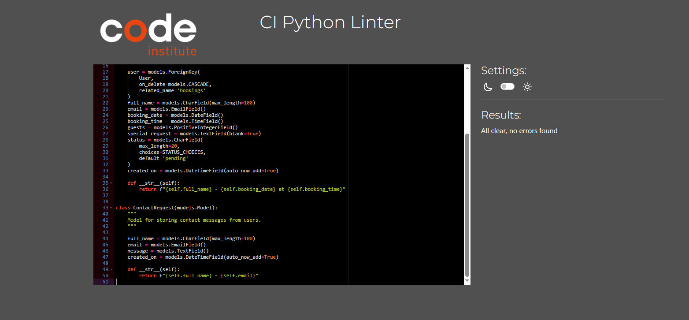
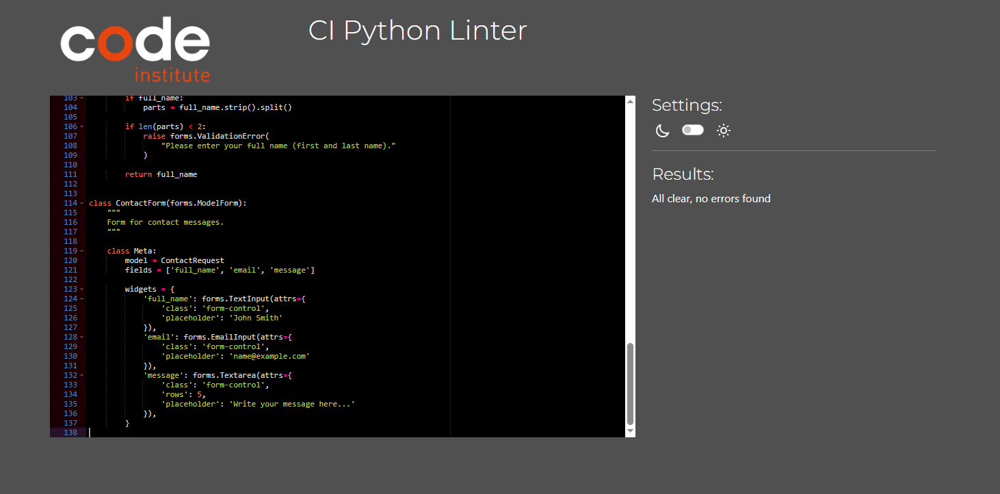
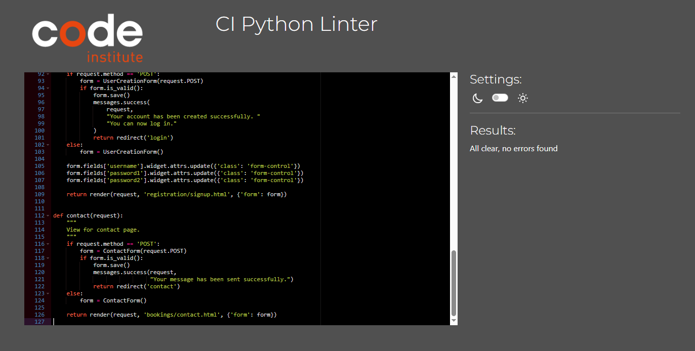
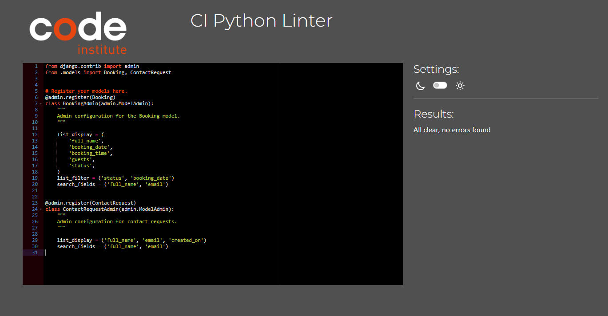
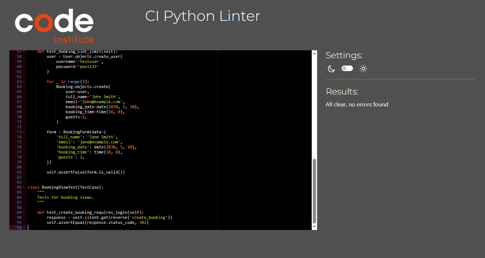
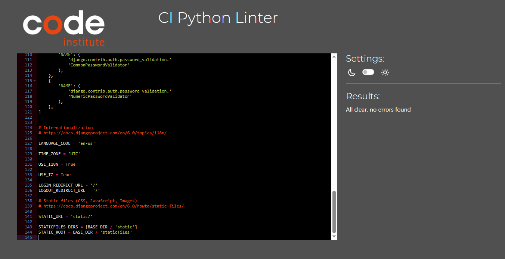
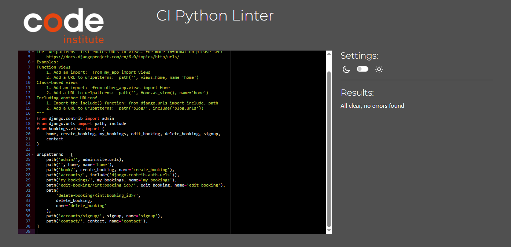
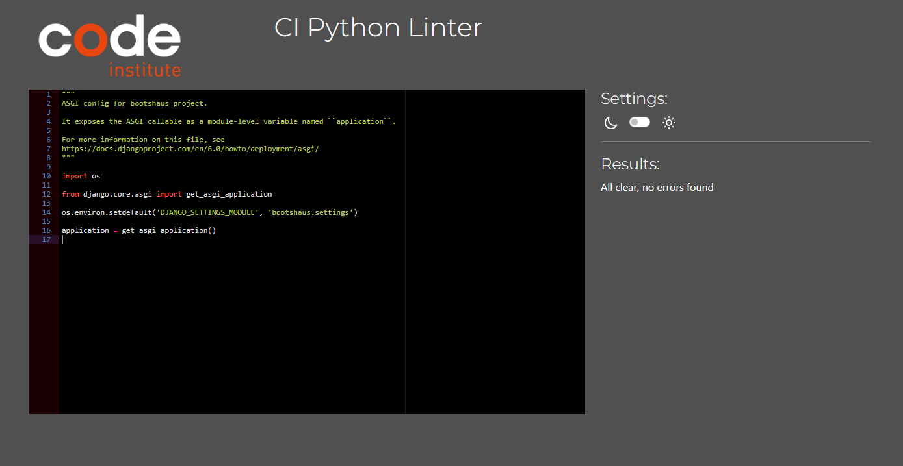
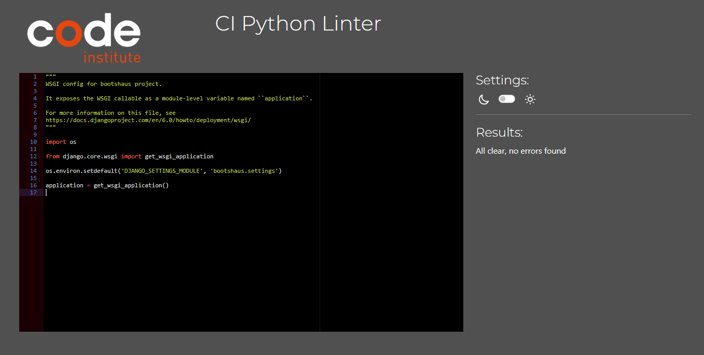
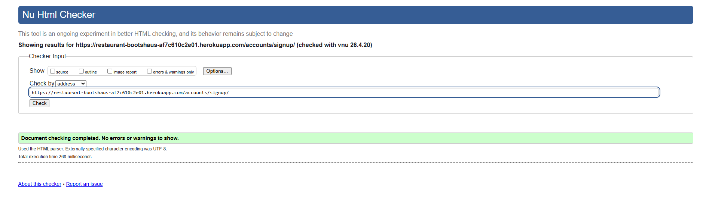

### Automated Testing

Automated tests were created using Django's built-in testing framework.

The tests cover:

- Valid booking form submission
- Full name validation
- Guest number validation
- Past date validation
- Booking slot limit validation
- Login protection for the booking page

All automated tests passed.

To run the tests, the following command was used:

python manage.py test

All tests ran successfully with the following result:
    - Ran 6 tests in Xs

    - OK

### Manual Testing

| Feature | Test | Expected Result | Actual Result | Pass/Fail |
|---------|------|------------------|--------------|-----------|
| Navigation | Click Home link | User is taken to homepage | Works as expected | Pass |
| Navigation | Click Book link while logged out | User is redirected to login page | Works as expected | Pass |
| Registration | Submit valid registration form | Account is created successfully | Works as expected | Pass |
| Registration | Submit mismatched passwords | Error message is displayed | Works as expected | Pass |
| Login | Log in with valid credentials | User is logged in | Works as expected | Pass |
| Logout | Click logout button | User is logged out | Works as expected | Pass |
| Create Booking | Submit valid booking form | Booking is created and saved | Works as expected | Pass |
| Create Booking | Submit booking with past date | Error message is displayed | Works as expected | Pass |
| Create Booking | Submit booking with one name only | Error message is displayed | Works as expected | Pass |
| Create Booking | Submit booking with more than 10 guests | Error message is displayed | Works as expected | Pass |
| Booking Availability | Try to create fourth booking for same time slot | Booking is rejected with availability message | Works as expected | Pass |
| My Bookings | View bookings while logged in | User sees only their own bookings | Works as expected | Pass |
| Edit Booking | Update an existing booking | Booking details are updated | Works as expected | Pass |
| Delete Booking | Delete an existing booking | Booking is removed from list | Works as expected | Pass |
| Contact Form | Submit valid contact form | Message is saved and success message shown | Works as expected | Pass |
| Admin Panel | Log in as superuser | Admin can view bookings and contact messages | Works as expected | Pass |
| Responsiveness | View pages on different screen sizes | Layout remains usable and responsive | Works as expected | Pass |
| Deployment | Open deployed Heroku site | Live site loads correctly | Works as expected | Pass |

## Code Validation

- Python docstrings were written with reference to [PEP257](https://peps.python.org/pep-0257/).

---

- Python code was checked against PEP8 using [CI Python Linter](https://pep8ci.herokuapp.com/).

Some issues were identified, including:
- Lines exceeding the maximum character limit (E501)
- Indentation inconsistencies (E128)

These issues were resolved by:
- Breaking long lines into multiple shorter lines
- Adjusting indentation to follow PEP8 guidelines

- Django migration files were not modified, as they are automatically generated by Django and do not require manual styling corrections.

Files checked:

- manage.py
- bootshaus/settings.py
- bootshaus/urls.py
- bootshaus/asgi.py
- bootshaus/wsgi.py
- bookings/admin.py
- bookings/apps.py
- bookings/forms.py
- bookings/models.py
- bookings/tests.py
- bookings/views.py

Screenshots of validation results are included below.

---

- HTML pages were checked using the [W3C HTML Validator](https://validator.w3.org/).

Pages tested:

- Home
- Sign Up
- Login
- Booking
- My Bookings
- Contact

---

### Bugs

#### Fixed Bugs

- HTML validation errors were identified on the signup page where `aria-describedby` attributes referenced non-existent elements. This was resolved by adding corresponding help text elements with matching IDs.

- Additional HTML validation errors were found due to incorrectly nested and unclosed `<form>` and `
` elements. These were fixed by restructuring the template to ensure proper opening and closing of tags.

- Layout issues were identified on mobile devices where elements were not properly aligned. These were resolved by using Bootstrap grid classes and container structure.

#### Remaining Bugs

- No major bugs remain at the time of submission.